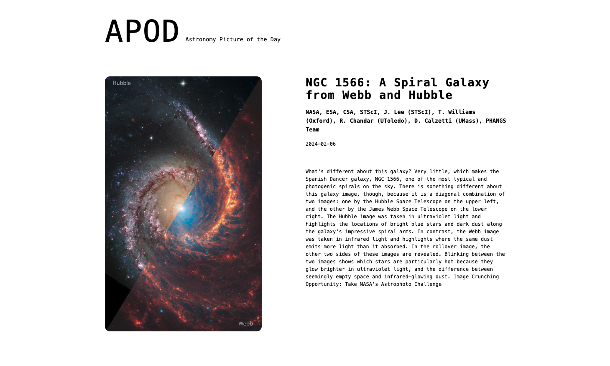

# NASA - Astrology Picture of the Day

This was a project I originally did while at BloomTech using Webpack and Styled Components. I've since migrated it to Next.js using TailwindCSS for styling. The app uses the NASA Photo of the Day API

## Demo

[APOD - Astrology Picture of the Day](https://nasa-pic-of-the-day.vercel.app/)

## Screenshots

## Challenges

- **add in what routes I tried, why they didn't work, what route I ended up with and why**
- went w/ the latter, and got the right data. But now it doesn't update daily like it's supposed to -- so I think it only renders on build (as I read something about that) as opposed to page load

This was a project that was originally created with Webpack. I wanted to convert it to Next.js as it seemed simple enough to make the migration.

I eventually decided the project was small enough to just create a new Next.js project and rebuild this from scratch. All went smooth, as expected, until trying to figure out which method to use to call the APOD API. Previously, I was using useState, useEffect, and `axios`. When researching the migration I had seen that `axios` was not the preferred method in Next.js because it would take away from the performance capabilities that Next.js had.

So, first I tried.....(TBD)
